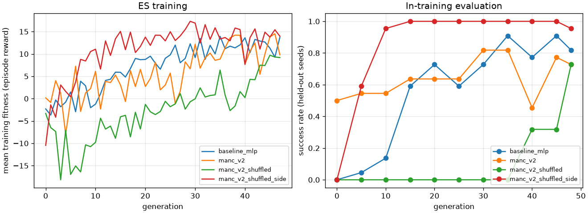

# EXPERIMENTS — reach-target

Protocol and hypotheses were written **before** any learned-brain result was seen.
Results are appended below them and are never edited to fit.

## Protocol

**Task (Task 1).** Flat ground. The fly spawns at the origin facing +x. The target
(visual only) is placed 6–10 mm away at a uniformly random bearing in (−π, π], so it may
be behind the fly. Success means the thorax comes within 1 mm (xy) of the target centre
within 3 s of simulated time (150 brain ticks at 20 ms).

**Reward per tick.** 1.0 × (progress in mm) + 10 on reach − 0.5 per tick in obstacle
contact − 0.01.

**Observation.** 12-d egocentric vector (ARCHITECTURE.md §4). **Action.** `(forward,
turn)` → descending `[L, R]` with `|·| ≤ 1.2`.

**Optimiser.** Identical for all brains: antithetic ES with 8 pairs (population 16),
σ = 0.1, Adam with lr 0.05, weight decay 0.005, 2 episodes per candidate, and common
random seeds within a generation. The budget is 1,536 training episodes (48
generations). During training, 22 held-out seeds are evaluated every 5 generations, and
the best of those checkpoints is kept.

**Test.** 44 fresh seeds (≥ 20,000,000), disjoint from training and in-training eval
seeds. We report success rate, time and steps to target (successes only), distance
traveled, collision ticks and onsets, reward, and final distance.

| id | brain | params | what it tests |
|---|---|---|---|
| R0 | random actions | 0 | floor |
| R1 | `SteeringReflex` (hand-coded) | 0 | solvability and a practical ceiling |
| E1 | `MLPPolicy` 12→16→2 | 242 | Milestone 5 baseline |
| E2 | `MANCPolicy`, real MANC v1.0 wiring | 430 | Milestone 6 architecture |
| E3 | `MANCPolicy`, wiring shuffled within class | 430 | does MANC structure matter? |
| E4 | `MANCPolicy`, wiring shuffled within class *and side* | 430 | is laterality the part that matters? |

**Milestone 9 (unfamiliar environments, no retraining).** Every trained brain is tested on:

- **G1 obstacles:** 2 cylinders (r = 1 mm) placed between the fly and the target. No
  brain saw an obstacle during training, so the obstacle observations are novel.
- **G2 far targets:** 12–18 mm with 5 s episodes. The distances are outside the
  training range.

## Variables

- **Independent variable (what I change):** the brain between senses and legs. Levels:
  random actions, hand-coded reflex, MLP, MANC-constrained (real wiring), MANC shuffled
  within class, MANC shuffled within class and side. Two further single-variable sweeps:
  the reward's heading term (0 or 0.02) and the connectome's synapse threshold
  (min_weight 5, 10, 20).
- **Dependent variables (what I measure):** success rate, time to target, steps to
  target, distance traveled and its smoothed path efficiency, collision ticks and
  separate bumps, final distance, episode reward, flips.
- **Controlled (identical for every condition):** the simulator and its pinned commit,
  the body, the CPG and reflex controller, the 12-d observation, the action space and
  drive limit, the 3 s episode length and 20 ms brain tick, the task distribution
  (6–10 mm, any bearing), the optimiser and all its settings, the budget (48 generations
  x 32 episodes = 1,536 episodes), the training seeds, the 22 in-training evaluation
  seeds, and the 44 test seeds. Checkpoints are always selected on in-training seeds only.
- **Sample sizes:** 44 episodes per test set per brain (the same seeds for all brains),
  22 per in-training evaluation, 1,536 training episodes per run, one ES seed per
  condition.

## Hypotheses

- **H1:** E1 learns the task well above R0.
- **H2:** E2 learns the task. Its encoder is exactly left/right mirror-symmetric, so
  every left/right drive difference, and hence every turn, has to come from the lateral
  structure of the MANC DN → IN → MN wiring. Driving only left-side input DNs activates
  left leg-MN pools 3.2× more than right ones (0.0048 vs 0.0015).
- **H3:** E3 (laterality destroyed: 0.0035 vs 0.0023) steers worse than E2, with lower
  success and longer times to target.
- **H4:** E4 (laterality kept, specific wiring destroyed: 0.0038 vs 0.0016) is close to
  E2. If so, the benefit of MANC here is its bilateral organisation, not its fine wiring.
- **H5:** No brain avoids obstacles in G1 without obstacle training, so collision ticks
  rise. Success should drop most for brains that rely on straight-line approach.

## Verification and validation

- **The simulator is untouched:** `git -C simulator status` is clean at the pinned commit
  `38c8ec6`, and FlyGym's own test suite passes (**76 tests**) after all our changes.
- **Project tests: 15 pass** (`python -m pytest tests`). They cover the observation
  geometry and both turn directions, obstacle collision and occlusion, the heading-reward
  term, the MANC circuit's counts and normalisation, both shuffles, encoder mirror
  symmetry, the ES ranking, and two regression tests for bugs found here (the cached
  controller is bit-identical to FlyGym's, and the standardized readout survives ES noise
  where the old one saturated).
- **Task validity, measured not assumed:** a hand-coded reflex reaches 43/44 test targets
  (0.79 s) and random actions 3/44. The task is solvable and it discriminates.
- **Determinism:** replaying a checkpoint on a seed reproduces the recorded episode
  exactly. This was used to recover an overwritten result set field-for-field.
- **Degenerate-run detection:** the trainer now warns when every candidate in a
  generation scores the same, the failure mode that silently wasted the first MANC run.

## Limitations known in advance

- There is one ES seed per condition. Differences below about 10 success-rate points
  (roughly ±7 points binomial SE at n = 44) are not interpretable without more seeds.
- The observations are privileged geometry, not ommatidia input.
- MANC enters as a tonic, per-side drive into FlyGym's CPG, not as a rhythm generator
  (ARCHITECTURE.md §5).

## Results

Status at 2026-09-19 13:35. **E1 is done (test results below). E2–E4 run as the v2 runs, and they and the
reference re-runs are queued** (`scripts/queue_v2.sh`, see Failure 1). This section fills in as runs
finish, and the tables below are regenerated with `experiments/report.py`.

### E1: MLP baseline, in-training evaluation (22 held-out seeds, 10,000,000+)

| generation | success | mean reward | mean time to target (s) | collision ticks |
|---|---|---|---|---|
| 0 | 0.00 | −1.38 | – | 0 |
| 5 | 0.05 | 1.38 | 1.82 | 0 |
| 10 | 0.14 | 1.70 | 2.23 | 0 |
| 15 | 0.59 | 10.61 | 2.57 | 0 |
| 20 | **0.73** | 12.93 | 2.24 | 0 |
| 25 | 0.59 | 11.65 | 2.14 | 0 |
| 30 | 0.73 | 13.23 | 2.28 | 0 |
| 35 | **0.91** | 15.32 | 2.04 | 0 |
| 40 | 0.77 | 13.58 | 2.40 | 0 |
| 45 | 0.91 | 15.15 | 2.27 | 0 |
| 48 (final) | 0.82 | 14.14 | 2.30 | 0 |

Training finished. The checkpoint used for all tests is `theta_best.npy`, chosen on
in-training eval seeds only: generation 35 (0.91, reward 15.32).

Reading so far: H1 is on track. From 0% the MLP reached 73% success on seeds it never
trained on, within 20 generations (640 training episodes). Its time to target (about
2.2 s) is still 3× slower than the hand-coded reflex (0.74 s in the 4 s calibration run).
The video check below shows why. These are in-training numbers. The final
claim rests on the 44-seed test set, below. On it E1 reaches **86.4%** (38/44), so H1 is
supported. The random floor at the matched 3 s episode length is re-measured by the queue.

Interim video check (generation-20 checkpoint, 3 test seeds, all successful:
`experiments/results/baseline_mlp/eval_interim_gen20/videos/`): the policy does **not**
walk straight to the target. **Correction:** an earlier version of this paragraph said
the paths were "about 25 mm, roughly 3.5× the straight-line distance". That figure came
from `distance_traveled`, which sums the thorax position every 20 ms and so includes the
side-to-side body sway of each step. After a 100 ms moving average, the paths are about
11 mm for 6.6–9.1 mm targets, 1.46× straight. "Looping" was also the wrong description.
Design Iteration 1 below diagnoses the behaviour. Generation 25 gave 0.59 held-out
success, below generation 20's 0.73, so the best-checkpoint selection matters.

### Design Iteration 1: the baseline approaches targets walking backwards

**Symptom.** The generation-20 checkpoint was replayed on the same 3 seeds. The replay is
deterministic and reproduced the recorded times to target exactly (2.28, 2.74 and
1.92 s). It was instrumented per brain tick with `experiments/diagnose_looping.py`, and
output is in `experiments/results/diagnosis_looping/gen20/` (`paths.png`, `ticks.csv`,
`summary.json`).

| measure | value | what it rules in or out |
|---|---|---|
| turn command sign flips between ticks | **0%** | not an oscillating or over-correcting controller |
| mean turn command (+ = clockwise) | +0.63, and +0.75 when the target is within ±20° ahead | a constant clockwise bias that persists even when aligned |
| mean forward command | **−0.46** | descending drive ≈ 1.2·[+0.17, −1.09]: the right legs step backwards |
| ticks moving backwards (thorax velocity · heading < 0) | **58%** | the approach is mostly in reverse |
| ticks with the target behind (\|bearing\| > 90°) | 70%, settling at +130° to +170° | the fly turns its back to the target, then backs toward it |
| net rotation per episode | −3.5 to −4.2 rad (≈ 200–240° clockwise) | one large pivot, not repeated loops |
| turn vs bearing correlation | −0.47 | bearing only modulates the arc, it does not steer |
| smoothed path / straight-line distance | 1.46 | curved, but not a loop |

**Hypothesis.** The reward (progress in mm, plus 10 on reach, minus a time cost) does not
depend on which way the body faces. A single stereotyped command, "pivot clockwise, then
back up in an arc", with weak bearing modulation reaches most targets. ES found that local
optimum first. Reversed stepping in FlyGym's CPG is slower than forward walking, which
explains the 2.2 s time to target against the reflex's 0.74 s. Nothing is missing from the
observation: the target bearing is already given as (cos, sin).

**Proposed change (one term).** Add a heading-alignment reward of
`+ c_heading · cos(target bearing)` per tick, with `c_heading = 0.02`. Facing the target
earns up to +3 over a 150-tick episode, and backing toward it costs up to −3. That is
comparable to the reach bonus (10) and progress (about 8), but does not dominate them.
Everything else stays identical: observation, action space, optimiser, budget (48
generations, 3 s episodes) and seeds. The change goes into a new config
`configs/reach_target_v2.yaml` (`heading_reward` defaults to 0, so all existing configs
behave exactly as before).

**Result: the change did what it was designed to do to the behaviour, and it did not
help the task.** `baseline_v2` was trained with the identical budget, env and seeds
(`configs/reach_target_v2.yaml`, only `heading_reward: 0.02` differs). Both checkpoints
were then replayed on all 44 test seeds with per-tick tracing
(`experiments/results/diagnosis_looping/{v1,v2}_test44/`).

| measure (44 test seeds) | v1 original | v2 heading reward | change |
|---|---|---|---|
| ticks moving backwards | 55.8% | **19.8%** | intended effect, large |
| ticks with the target behind | 79.5% | **58.7%** | intended effect |
| mean forward command | −0.44 (reverse) | **+0.28** (forward) | intended effect |
| mean turn command | +0.70 (clockwise) | −0.73 (counter-clockwise) | still a constant bias, now the other way |
| turn vs bearing correlation | +0.04 | +0.23 | still not proportional steering |
| test success | 38/44 (0.86) | 34/44 (0.77) | worse, p = 0.41 |
| smoothed path ÷ straight line (successes) | **1.37** | 1.98 | worse |
| time to target | 2.01 s | 2.06 s | unchanged |
| G2 far targets | 36/44 | 32/44 | worse, p = 0.45 |
| G1 2 obstacles | 3/44 | 0/44 | worse, p = 0.24 |

(Fisher exact, two-sided; none of the differences are significant at n = 44.)

**What this says about the diagnosis.** The symptom I targeted, backwards approach, was
real and the one-line reward change removed most of it. But removing it did not make the
fly better or more efficient. So walking backwards was not *why* the paths were
indirect. Both policies share the deeper problem the trace already showed: **neither
steers in proportion to the target bearing** (correlation +0.04 and +0.23, where real
steering needs a clear negative correlation). Both use an open-loop strategy, "rotate at
a constant rate and walk", and just sweep until the target happens to be reached. v1
swept backwards and v2 sweeps forwards on a wider arc, which is why v2's paths are
*longer* (1.98 against 1.37).

**Next iteration, specified but not run:** reward or curriculum pressure on *closed-loop*
steering rather than on body orientation, for example a term proportional to
`−|bearing|` change per tick (turn toward the target, not merely face it), or a
curriculum that starts with targets ahead and widens the bearing range. Predicted effect:
turn-vs-bearing correlation goes clearly negative and path efficiency approaches the
reflex's. Left for a future run so the current comparison stays clean.

**Side-by-side video** (same episode, seed 20000002, both succeed):
`experiments/results/design_iteration_1/before_after_seed20000002.mp4`, left = v1
original (1.72 s, 18.6 mm of path), right = v2 heading reward (2.84 s, 30.8 mm). The left
fly backs into the target; the right one faces forward but loops wider.

**Note for the fair:** this is the honest outcome of a designed intervention. The
hypothesis was specific, the measurement was pre-planned, the intervention changed
exactly what it was predicted to change, and the task metric still did not improve. That
is a result, not a failure of the method.

### Failure 1: the first MANC run (`manc`) never learned, because of a readout-scaling bug

**Symptom.** From generation 5 onward, every one of the 16 ES candidates in a generation
scored exactly the same (mean fitness = max fitness in `manc/generations.csv`). Held-out
evaluations were identical at generations 5, 10, 15 and 20: success 0.14, reward −21.00.
There were tied fitness values in 17 of 17 generations (241 tied values in all). The
baseline had **0** ties in 48 generations.

**Cause, confirmed on the saved parameters.** The legacy readout
`D = tanh(g·(pool − θ))` puts the threshold θ on the motor-pool scale (activity about
0.001–0.005, initial θ = 0.0016, g ≈ 1,370). ES perturbs every parameter with σ = 0.1,
which is roughly 60 times the pool range. θ drifted to 0.465, far above any pool
activity. Both drives were then pinned at −1, so the output was `forward = −1, turn = 0`
for every observation (checked on 20 random observations, and still with θ ± 0.1). The
fly backed away at full speed whatever it sensed. Every candidate behaved identically,
so ES had no signal. A second, minor effect: with tied fitness, the ordinal ranking
ranked candidates by index, which turned zero signal into a random-walk update.

**This is an implementation bug, not a finding about MANC.** The run was stopped at
13:25 by the user's decision, after 20 of 48 generations. Its directory `manc/` is kept
unchanged as the record. The queued `manc_shuffled*` runs used the same readout and were
never started.

**Fix (Design Iteration 2).**
1. A standardized readout, `D = tanh(a·(pool − μ)/sd + b)`. μ and sd are fixed
   constants from a canonical calibration with a fixed seed, identical in every process.
   Only log a and b are learned, both O(1). The three per-class biases, which had the
   same scale problem, are dropped, giving 427 learnable parameters instead of 430.
2. Tie-aware ES ranking: tied fitness gets its average rank, so a degenerate
   generation produces no update. Without ties this is bit-identical to the old ranking,
   and the baseline never had ties, so E1 is unaffected.
3. A warning line in the training log whenever a generation is degenerate.

**Verification before retraining.** New tests in `tests/test_brain.py` (8/8 pass):
- Under ES-sized noise the legacy readout pins 50% of its outputs at ±1 (turn is always
  exactly 0), and the standardized one pins 0%.
- The legacy mode is unchanged.
- The calibration constants are identical across seeds.
- The ranking is unchanged whenever there are no ties.

A 3-generation smoke run gave distinct candidate scores in every generation and no
degenerate warnings.

**Consequence for the protocol.** E2, E3 and E4 are run as `manc_v2`,
`manc_v2_shuffled` and `manc_v2_shuffled_side` (`configs/reach_target_manc_v2*.yaml`),
with the same env, ES settings, budget and seeds as E1. The pre-registered hypotheses
H2–H4 are unchanged.

### Test set, G1 (obstacles), G2 (far targets)

Every brain is scored with its `theta_best.npy` on the same 44 seeds (20,000,000–20,000,043).
E4 and the references are pending; the queue runs `scripts/evaluate_run.sh` after
each training run.

| brain | set | success | mean time to target (s) | collision ticks / onsets | final distance (mm) | flipped |
|---|---|---|---|---|---|---|
| E1 MLP | test | **0.86** (38/44) | 2.01 | 0 / 0 | 0.95 | 0 |
| E1 MLP | G1: 2 obstacles | **0.07** (3/44) | 1.41 | 90.7 / 8.5 | 4.60 | 1 |
| E1 MLP | G2: far targets 12–18 mm, 5 s | 0.82 (36/44) | 3.93 | 0 / 0 | 1.04 | 0 |
| E2 MANC v2 | test | **0.98** (43/44) | **1.24** | 0 / 0 | 0.92 | 0 |
| E2 MANC v2 | G1: 2 obstacles | 0.14 (6/44) | 1.60 | 74.0 / 2.5 | 4.74 | 2 |
| E2 MANC v2 | G2: far targets 12–18 mm, 5 s | 0.77 (34/44) | 2.74 | 0 / 0 | 3.21 | 0 |
| E3 MANC v2, shuffled within class | test | 0.84 (37/44) | 2.06 | 0 / 0 | 1.15 | 0 |
| E3 MANC v2, shuffled within class | G1: 2 obstacles | **0.00** (0/44) | – | 61.8 / 4.4 | 5.12 | 2 |
| E3 MANC v2, shuffled within class | G2: far targets 12–18 mm, 5 s | 0.50 (22/44) | 3.04 | 0 / 0 | 2.31 | 0 |
| E4 MANC v2, shuffled within class+side | test | **0.98** (43/44) | **1.04** | 0 / 0 | 0.91 | 0 |
| E4 MANC v2, shuffled within class+side | G1: 2 obstacles | 0.11 (5/44) | 2.19 | 52.6 / 5.4 | 5.33 | 0 |
| E4 MANC v2, shuffled within class+side | G2: far targets 12–18 mm, 5 s | **1.00** (44/44) | 1.66 | 0 / 0 | 0.88 | 0 |
| R1 reflex (hand-coded) | test | 0.98 (43/44) | **0.79** | 0 / 0 | 0.86 | 0 |
| R1 reflex (hand-coded) | G1: 2 obstacles | **0.48** (21/44) | 1.16 | 75.0 / – | 3.19 | 0 |
| R1 reflex (hand-coded) | G2: far targets | 0.98 (43/44) | 1.22 | 0 / 0 | 0.93 | 0 |
| R0 random | test | 0.07 (3/44) | 2.69 | 0 / 0 | 9.11 | 0 |
| R0 random | G1: 2 obstacles | 0.00 (0/44) | – | 32.1 / – | 10.4 | 0 |
| R0 random | G2: far targets | 0.00 (0/44) | – | 0 / 0 | 15.6 | 0 |

Reading E1:
- **G2:** the approach generalises to targets 1.5–2× further than any seen in training,
  with success only 5 points below the test set. The extra time scales with the extra
  distance.
- **G1:** obstacles break the policy. Success collapses from 86% to 7%. The fly is in
  contact with an obstacle for 91 of about 150 ticks, and it bumps into one 8.5 times per
  episode on average. It never learned to use the obstacle observations, which were
  constant during training. This is H5's prediction.
- **Mechanism:** the backwards-arc approach from Design Iteration 1 is the likely reason
  G1 fails so badly. The fly is blind to where it is going and backs into obstacles.
  Step 4 (obstacle counts 0/1/2) will quantify this per brain.

Reading E2 against E1 (both single ES seeds, 44 test episodes each; two-sided Fisher exact
tests):
- **H2 supported: the MANC-constrained brain learns the task.** It succeeds on 43/44
  test episodes against the MLP's 38/44 (p = 0.11, so not significant at this sample
  size). It reaches targets in 1.24 s against 2.01 s. Its steering has to pass through
  MANC's lateral wiring, because its encoder is exactly mirror-symmetric.
- It generalises about as the MLP does: G2 34/44 vs 36/44 (p = 0.79). It also collapses
  with obstacles, G1 6/44 vs 3/44 (p = 0.48). It touches obstacles for fewer ticks (74 vs
  91) and has fewer separate bumps (2.5 vs 8.5).
- In-training held-out success peaked at 0.82 (22 seeds) but the test set gave 0.98 (44
  seeds). Both are single estimates. The binomial SE at n = 44 is about ±2–5 points near
  these rates, and at n = 22 about ±8.

Reading E3, the same architecture and budget with the MANC wiring shuffled within
each class (laterality destroyed), against E2:

| | E2 real MANC | E3 shuffled | Fisher p (two-sided) |
|---|---|---|---|
| held-out success by generation 0 / 10 / 20 / 30 / 40 / 48 | 0.50 / 0.55 / 0.64 / 0.82 / 0.45 / 0.73 | 0.00 / 0.00 / 0.00 / 0.00 / 0.32 / 0.73 | – |
| mean held-out success over the 11 in-training evaluations | 0.64 | 0.12 | – |
| test success | 43/44 | 37/44 | 0.058 |
| test time to target (s) | 1.24 | 2.06 | – |
| G2 (far targets) success | 34/44 | 22/44 | **0.014** |
| G1 (2 obstacles) success | 6/44 | 0/44 | 0.026 |

- **H3 is supported in a revised form: the shuffled wiring can still learn, but slowly
  and to a worse policy.** With laterality destroyed, the brain reached no targets on
  held-out seeds for 30 generations. It caught up only at the very end of the budget
  (0.73 at generation 48). On the test set it is slower (2.06 s against 1.24 s) and less
  successful, though that difference is not significant (p = 0.058). The clearest gap is
  on the unfamiliar far targets: 22/44 against 34/44, p = 0.014. That one survives a
  Bonferroni correction for these three comparisons (0.05/3 = 0.017). G1 does not
  (p = 0.026).
- **Caveat on generation 0.** Untrained, the real-wiring brain already reached 50% of
  held-out targets, and the shuffled one 0%. Both used the same random encoder and
  readout initialisation. A plausible reading: the real wiring turns any left/right
  imbalance in descending input into a turn, so a random encoder happens to steer
  somewhat. With shuffled wiring that imbalance does not reach the motor pools as a
  left/right difference. The sign of that initial steering is luck of the random
  encoder, and this is one seed. It is a hypothesis for a replication, not a result.
- The pre-registered H3 predicted lower success and longer time to target. Both hold in
  direction; statistically, only the far-target generalisation gap is clear with one seed
  per condition.

### E4 and the verdict on H4: laterality is what MANC contributes here

E4 keeps MANC's left/right organisation but scrambles which specific neuron talks to
which inside each side. It matches or beats the real wiring everywhere:

| | E2 real MANC | E4 lateral shuffle | E3 full shuffle | Fisher p, E4 vs E2 |
|---|---|---|---|---|
| held-out success at generation 10 / 20 / 30 | 0.55 / 0.64 / 0.82 | **0.95 / 1.00 / 1.00** | 0.00 / 0.00 / 0.00 | – |
| test success | 43/44 | 43/44 | 37/44 | 1.00 |
| test time to target (s) | 1.24 | **1.04** | 2.06 | – |
| G2 far targets | 34/44 | **44/44** | 22/44 | **0.0011** |
| G1 2 obstacles | 6/44 | 5/44 | 0/44 | 1.00 |

- **H4 is supported, and more strongly than predicted.** Keeping laterality and
  destroying the fine wiring costs nothing here, and E4 even generalises better to far
  targets (44/44 against 34/44, p = 0.0011, which survives Bonferroni for the three
  comparisons). E3, which destroys laterality, is the one that suffers.
- **The honest reading: on this task, the useful part of the MANC connectome is its
  bilateral organisation, not its specific synaptic wiring.** A brain whose 136k
  connections are randomly re-drawn within each side does the job as well or better. The
  task only needs "drive the left legs differently from the right ones", and any wiring
  that preserves sides can express that. This does not say the fine wiring is useless in
  general; it says this reach-target task does not need it.
- **Correction to the earlier generation-0 note.** I suggested that the untrained
  real-wiring brain's 50% start came from laterality turning random input imbalance into
  turning. E4 keeps laterality and still started at 0%, so that explanation does not hold.
  The generation-0 difference is most likely the luck of one random encoder interacting
  with one particular circuit, and it should not be read as a finding.

### How the brains actually steer (per-tick traces)

Replaying each best checkpoint with per-tick tracing shows *why* the MANC brains are
faster. Traces: 44 test seeds for the MLPs, the first 12 test seeds for the MANC brains
(`experiments/results/diagnosis_looping/`).

| measure | E1 MLP v1 | MLP v2 (heading) | E2 MANC real | E4 MANC lateral shuffle | reflex (by design) |
|---|---|---|---|---|---|
| turn command vs target bearing, correlation | +0.04 | +0.23 | **−0.52** | **−0.65** | −1 |
| ticks moving backwards | 56% | 20% | **8%** | **9%** | ~0% |
| mean angle off the target | 128° | 102° | **50°** | **49°** | small |
| smoothed path ÷ straight line | 1.37 | 1.98 | **1.26** | **1.22** | ~1.2 |

**The connectome-constrained brains learned closed-loop steering; the MLPs did not.** A
negative turn-vs-bearing correlation means "target on the left, turn left". Both MANC
brains have it, both MLPs do not, under the identical optimiser, budget, seeds, task and
action space. That is the mechanism behind the MANC brains' shorter times (1.0–1.2 s
against 2.0 s) and straighter paths, and it is a stronger claim than the success-rate
difference, which was not significant.

Why the architecture might make steering easier to find: the encoder is mirror-symmetric,
so a single set of learned weights produces opposite drives on the two sides
automatically, and the side-preserving wiring carries that difference to the leg motor
pools. The MLP has to discover the same left/right antisymmetry from scratch in an
unstructured 242-parameter space. This is a hypothesis consistent with the data, not
something these runs prove: the MANC traces are 12 episodes from one run each.

### Step 3: how sparse should the connectome circuit be?

Only the synapse-count threshold `min_weight` changes. Env, optimiser, budget (48
generations), seeds and the architecture are identical. Table and plot:
`experiments/results/sparsity_sweep/`.

| min_weight | nodes | edges | brain tick (ms) | params | best held-out | test success |
|---|---|---|---|---|---|---|
| 5 (denser) | 6,803 | 358k | 2.33 | 427 | 0.09 | **0.02** (1/44) |
| **10 (standard)** | 5,041 | 136k | 1.77 | 427 | **0.82** | **0.98** (43/44) |
| 20 (sparser) | 3,204 | 44k | 0.36 | 426 | 0.36 | 0.16 (7/44) |

- **There is a sweet spot, not a trend.** Both neighbours of the standard threshold are
  far worse on the same budget. Denser is the worst of the three, which is the opposite
  of "more connectome is better".
- **Compute scales with edges as expected:** 2.33 / 1.77 / 0.36 ms per brain tick. The
  brain is never the bottleneck: physics costs about 100 ms of wall time per tick.
  Wall-clock per generation (69.7 / 52.1 / 77.3 s median) is *not* a usable signal here,
  because the host steals cores unpredictably (single generations spiked to 476 s and
  941 s in other runs).
- **Two honest confounds.** (1) Changing the threshold changes which neurons are in the
  circuit *and* which 32 descending types are picked as input channels (they are ranked
  by in-circuit output), so this is not a pure density knob. (2) One ES seed per point;
  learning curves are noisy, and the dense run may simply have needed more generations.
  A plausible mechanism for the dense case: weights are normalised as a fraction of each
  neuron's input, so adding weak connections dilutes every strong one, and the extra
  inhibition arrives with it.

### Step 4: generalisation to 0, 1 and 2 obstacles

Same 44 seeds, same targets, nested obstacle layouts (the N=1 obstacle is also the first
of the two at N=2). No brain trained with obstacles. Chart:
`experiments/results/obstacle_sweep/obstacles.png`.

| brain | 0 obstacles | 1 obstacle | 2 obstacles | collision ticks at N=1 / N=2 |
|---|---|---|---|---|
| Hand-coded reflex | 43/44 | **30/44** | **21/44** | 50.6 / 75.0 |
| MLP v1 | 38/44 | 7/44 | 3/44 | 65.4 / 90.7 |
| MLP v2 (heading) | 34/44 | 7/44 | 0/44 | 38.4 / 71.2 |
| MANC real (E2) | 43/44 | 7/44 | 6/44 | 52.8 / 74.0 |
| MANC shuffled (E3) | 37/44 | 5/44 | 0/44 | 46.2 / 61.8 |
| MANC shuffled-side (E4) | 43/44 | **13/44** | 5/44 | **22.9** / 52.6 |
| Random | 3/44 | 2/44 | 0/44 | 17.9 / 32.1 |

- **One obstacle is enough to break every learned brain** (86–98% down to 11–30%), while
  the reflex keeps 68%. Two obstacles change little beyond that: the damage is done by
  the first.
- **The reflex degrades gracefully because it is closed-loop**: after a deflection it
  simply re-aims at the target. The learned brains are open-loop sweepers (see the
  steering traces above) and have no recovery behaviour, even though the obstacle
  distance and bearing are in their observation vector. During training those inputs were
  constant, so nothing ever made them useful.
- **E4 is again the best learned brain out of distribution**: nearly double the others at
  N=1 and the fewest collision ticks (22.9 against 38–65).
- This is the project's clearest engineering lesson: **train on the variation you want to
  survive.** It also predicts the fix, which is to add obstacles to training.

### References and H5

- **R0 random** (matched 3 s episodes): 3/44 on test, 0/44 on both generalisation sets.
  Every learned brain is far above it, so H1 and H2 are clear.
- **R1 the hand-coded reflex** is still the best controller overall: 43/44 on test at
  0.79 s (faster than every learned brain), 43/44 on far targets, and **21/44 with
  obstacles** against 5–6/44 for the learned brains (p = 0.0003 against E4).
- **H5 is supported.** Obstacles wreck every learned brain (0–14% success) but only halve
  the reflex. The reflex keeps facing the target and re-steers after each deflection,
  whereas the learned brains were trained with obstacle inputs that never varied, so they
  never learned to use them. This is the strongest argument in the project for training
  on the variation you want to generalise to.

### Provenance notes

- The first E1 attempt ran on the upstream controller path with 4 s episodes. I stopped
  it after 3 generations to switch to the bit-identical fast path
  (`tests/test_fast_controller.py`) and 3 s episodes. Its logs are kept in
  `experiments/results/_aborted_baseline_mlp_upstream_path/` and it is not used in
  any result.
- **The E1 test-set folder was overwritten, and the data was recovered by a
  deterministic re-run.** The queue wrote the official 44-episode E1 test to
  `baseline_mlp/eval_test/` at about 12:57. At 13:10 a 1-episode `--visual` look replaced
  it. That was the "Videos of a trained brain" command in the table below, which as
  first written here defaulted to `--tag test`, the official folder. That was a
  documentation and tooling error, not a user error. The queue's printed summary
  survives in `baseline_mlp/eval.log`. The identical evaluation (same checkpoint, same 44
  seeds, deterministic simulator) was re-run into `baseline_mlp/eval_test_regenerated/`.
  It reproduces every field of the logged summary exactly (success 0.8636…, time
  2.00894…, reward 14.4788…, final distance 0.95175…). The E1 test numbers above come
  from that folder. `eval_test/` itself was left as found.
  `evaluate.py` now refuses to write into a folder that already has results unless
  `--overwrite` is given. Without `--tag`, ad-hoc runs go to a new timestamped
  `eval_adhoc_…` folder.
- The reference numbers from calibration (reflex 22/22, random 3/22) used 4 s episodes.
  The queue re-runs R0 and R1 at 3 s on the same 44 test seeds as the learned brains.

### Step 6: demo readiness

**Cold-start check.** `scripts/demo_check.sh` ran the live-demo command for all 6 brains
at 0, 1 and 2 obstacles, each in a clean environment (`env -i`: no `MUJOCO_GL`, no
activated venv, minimal PATH), i.e. exactly a fresh terminal.
**18 of 18 runs exited 0 and produced both camera videos**
(`experiments/results/demo_check/timings.tsv`).

**Timing to expect on demo day** (one episode, both cameras, this laptop):

| situation | wall time |
|---|---|
| idle machine, cold start | **46 s** |
| four renders in parallel | 52–283 s each (median about 230 s) |
| while a training run holds the cores | about 90 s |

So a single live render takes under a minute if nothing else is running. Have a video
ready as a fallback, and do not start a render while training.

**Blind demo.** `scripts/blind_demo.sh` rendered one unlabeled top-down clip per brain
(reflex, MLP baseline, MANC) on the *same* episode (seed 20000001, target starts behind
the fly), with the letters assigned at random:
`experiments/results/blind_demo/clip_{A,B,C}.mp4`. The mapping is in
`ANSWER_KEY_PRIVATE.txt` (mode 600, presenter only). Clip lengths differ (208 / 226 / 116
frames) because the brains take different times, which is part of what the audience is
judging.

## How to see the results yourself

All paths are relative to `~/digital-fly`.

| What | How |
|---|---|
| Live progress of the queue and all runs | `scripts/status.sh` or `tail -f experiments/results/baseline_mlp.log` |
| Learning curves and results table | `.venv/bin/python experiments/report.py baseline_mlp manc manc_shuffled manc_shuffled_side`, which writes `experiments/results/learning_curves.png` and `experiments/results/report.md` |
| Every episode, raw | `experiments/results/<run>/train_episodes.csv`, `eval_episodes.csv`, and `eval_<set>/episodes.csv` (success, steps and time to target, distance, collisions, reward) |
| Videos of a trained brain | `MUJOCO_GL=egl .venv/bin/python experiments/evaluate.py --run experiments/results/baseline_mlp --episodes 3 --visual --tag look`, which writes `experiments/results/baseline_mlp/eval_look/videos/seed…_{success\|fail}/topdown.mp4` and `fly_follow.mp4`. Use a new `--tag` each time, or none, which picks a timestamped folder. Official folders (`test`, `g1_obstacles`, `g2_far`) are protected. The red disc is the target and blue cylinders are obstacles. |
| Same, with obstacles or far targets | add `--n-obstacles 2 --tag look_obstacles` or `--env "target_distance_range=[12.0, 18.0]" episode_length=5.0 --tag look_far` |
| Watch it live in the MuJoCo viewer | `.venv/bin/python experiments/evaluate.py --run experiments/results/baseline_mlp --episodes 1 --live` (needs a display. WSLg provides one, but this path is untested here.) |
| Hand-coded reference for comparison | `.venv/bin/python experiments/evaluate.py --brain reflex --visual --episodes 3 --tag look` |
| Unmodified FlyGym demo (Milestone 1) | `experiments/results/m1_upstream/hybrid_turning_controller.mp4` |
| Open files from Windows | `explorer.exe experiments/results` from the WSL shell, or open the folder in VS Code |

Rendering costs about 0.2 s per frame on this CPU, so a 3 s episode with 2 cameras takes
roughly 2 minutes. Running it while training is in progress slows the training.

— Henry Cao, 2026-09-19. Project ID: henrycao-2026-f003b4
