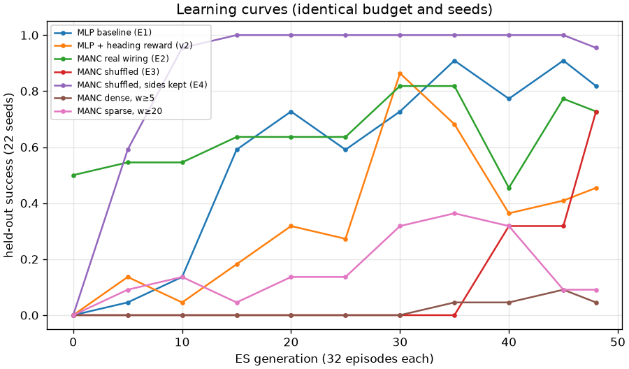
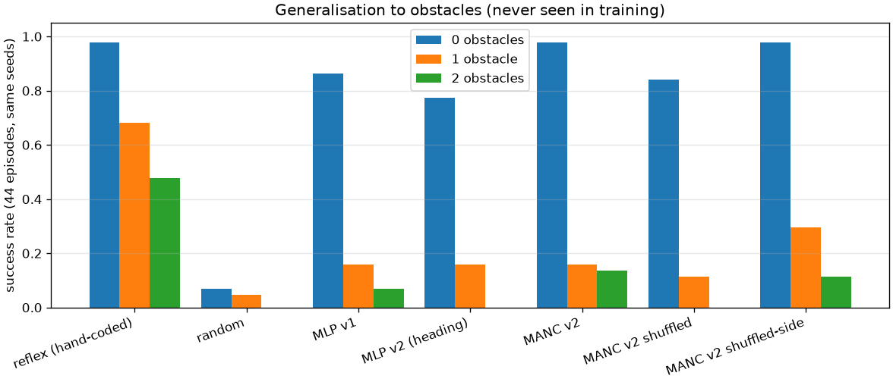

# Digital Fly / MANC — results

_Henry Cao, 2026-09-19. Project ID: henrycao-2026-f003b4._

A learned brain sits between the senses and the legs of an unmodified NeuroMechFly v2 (FlyGym) fly. The experimental brain routes its motor pathway through the male nerve-cord connectome (MANC v1.0). Full protocol, hypotheses and caveats: EXPERIMENTS.md. Pipeline and insertion point: ARCHITECTURE.md.

## 1. Success by brain

| brain                          |   standard targets success |   standard targets time (s) |   2 obstacles success | 2 obstacles time (s)   |   far targets success | far targets time (s)   | params   |
|:-------------------------------|---------------------------:|----------------------------:|----------------------:|:-----------------------|----------------------:|:-----------------------|:---------|
| Random (floor)                 |                       0.07 |                        2.69 |                  0    | –                      |                  0    | –                      |          |
| Hand-coded reflex              |                       0.98 |                        0.79 |                  0.48 | 1.16                   |                  0.98 | 1.22                   |          |
| MLP baseline (E1)              |                       0.86 |                        2.01 |                  0.07 | 1.41                   |                  0.82 | 3.93                   | 242      |
| MLP + heading reward (v2)      |                       0.77 |                        2.06 |                  0    | –                      |                  0.73 | 3.56                   | 242      |
| MANC real wiring (E2)          |                       0.98 |                        1.24 |                  0.14 | 1.60                   |                  0.77 | 2.74                   | 427      |
| MANC shuffled (E3)             |                       0.84 |                        2.06 |                  0    | –                      |                  0.5  | 3.04                   | 427      |
| MANC shuffled, sides kept (E4) |                       0.98 |                        1.04 |                  0.11 | 2.19                   |                  1    | 1.66                   | 427      |
| MANC dense, w≥5                |                       0.02 |                        2.98 |                  0    | –                      |                  0.09 | 3.80                   | 427      |
| MANC sparse, w≥20              |                       0.16 |                        1.54 |                  0    | –                      |                  0.07 | 2.40                   | 426      |

Every brain is scored on the same 44 held-out episodes (seeds 20,000,000+) with its best checkpoint, chosen on separate in-training seeds.

## 2. Learning curves

Identical optimiser, budget (48 generations x 32 episodes) and seeds for every brain.

## 3. Connectome sparsity trade-off

|   min_weight |   nodes |   edges |   density |   params |   build_s |   brain_tick_ms |   median_wall_s_per_gen |   best_heldout_success |   test_success | run         |
|-------------:|--------:|--------:|----------:|---------:|----------:|----------------:|------------------------:|-----------------------:|---------------:|:------------|
|            5 |    6803 |  358255 |  0.007742 |      427 |      4.96 |           2.325 |                   69.65 |                0.09091 |        0.02273 | manc_v2_w5  |
|           10 |    5041 |  135717 |  0.005342 |      427 |      4.09 |           1.766 |                   52.1  |                0.8182  |        0.9773  | manc_v2     |
|           20 |    3204 |   43811 |  0.004269 |      426 |      6.87 |           0.364 |                   77.3  |                0.3636  |        0.1591  | manc_v2_w20 |

Only the synapse-count threshold changes; env, optimiser, budget and seeds are fixed. Wall-clock per generation is noisy on this laptop (the host steals cores), so the isolated brain-tick time is the reliable compute measure.

## 4. Generalisation to obstacles

| brain | N=0 success | N=1 success | N=2 success | N=1 collision ticks | N=2 collision ticks |
|---|---|---|---|---|---|
| reflex (hand-coded) | 0.98 (43/44) | 0.68 (30/44) | 0.48 (21/44) | 50.6 | 75.0 |
| random | 0.07 (3/44) | 0.05 (2/44) | 0.00 (0/44) | 17.9 | 32.1 |
| MLP v1 | 0.86 (38/44) | 0.16 (7/44) | 0.07 (3/44) | 65.4 | 90.7 |
| MLP v2 (heading) | 0.77 (34/44) | 0.16 (7/44) | 0.00 (0/44) | 38.4 | 71.2 |
| MANC v2 | 0.98 (43/44) | 0.16 (7/44) | 0.14 (6/44) | 52.8 | 74.0 |
| MANC v2 shuffled | 0.84 (37/44) | 0.11 (5/44) | 0.00 (0/44) | 46.2 | 61.8 |
| MANC v2 shuffled-side | 0.98 (43/44) | 0.30 (13/44) | 0.11 (5/44) | 22.9 | 52.6 |

No brain saw an obstacle during training, so 1 and 2 obstacles are both unfamiliar.

## Verification

- Simulator untouched: `git -C simulator status` clean at the pinned commit, and FlyGym's own 76 tests pass.
- Project tests: 15 pass, including a bit-identical check of the cached controller path and a regression test for the readout-saturation bug.
- Reference policies bound the task: random 3/44, hand-coded reflex 43/44.
